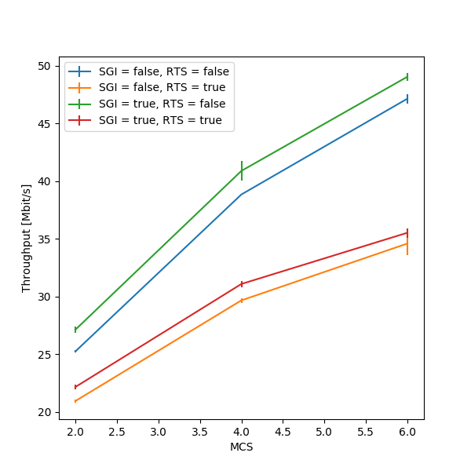
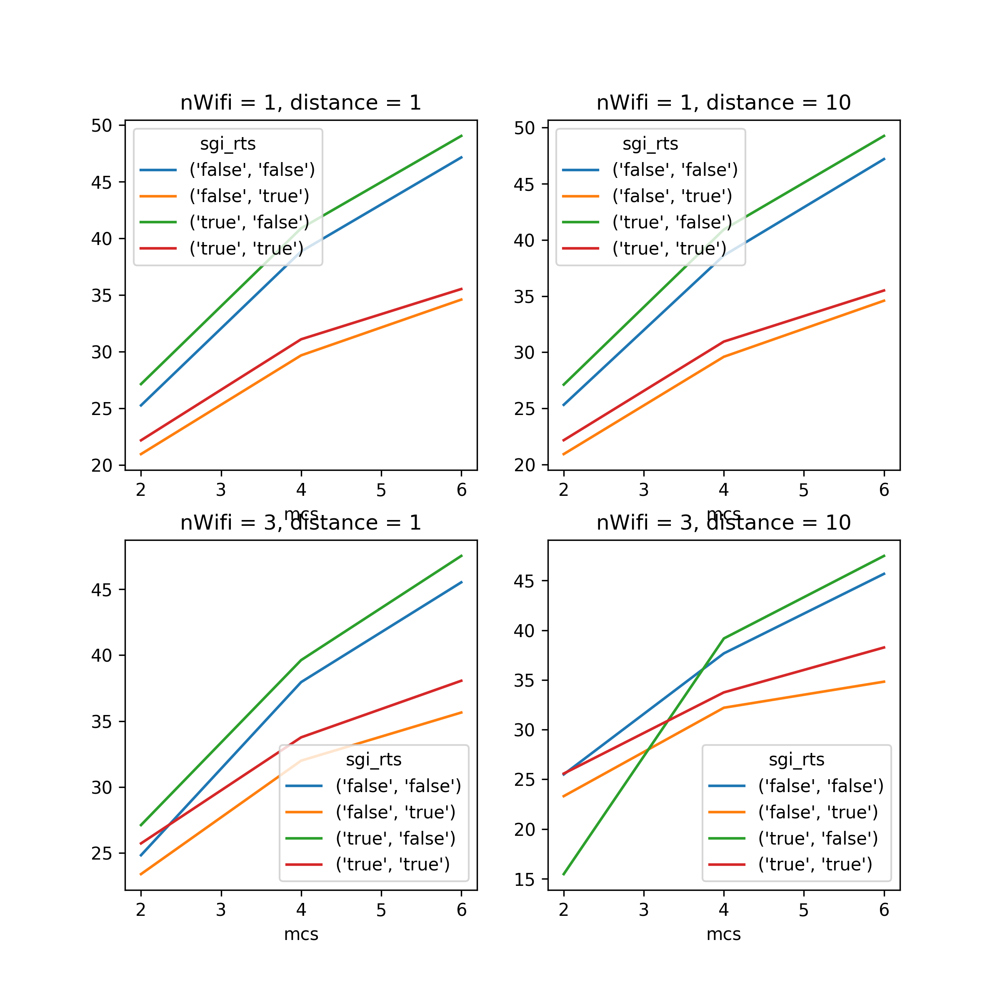
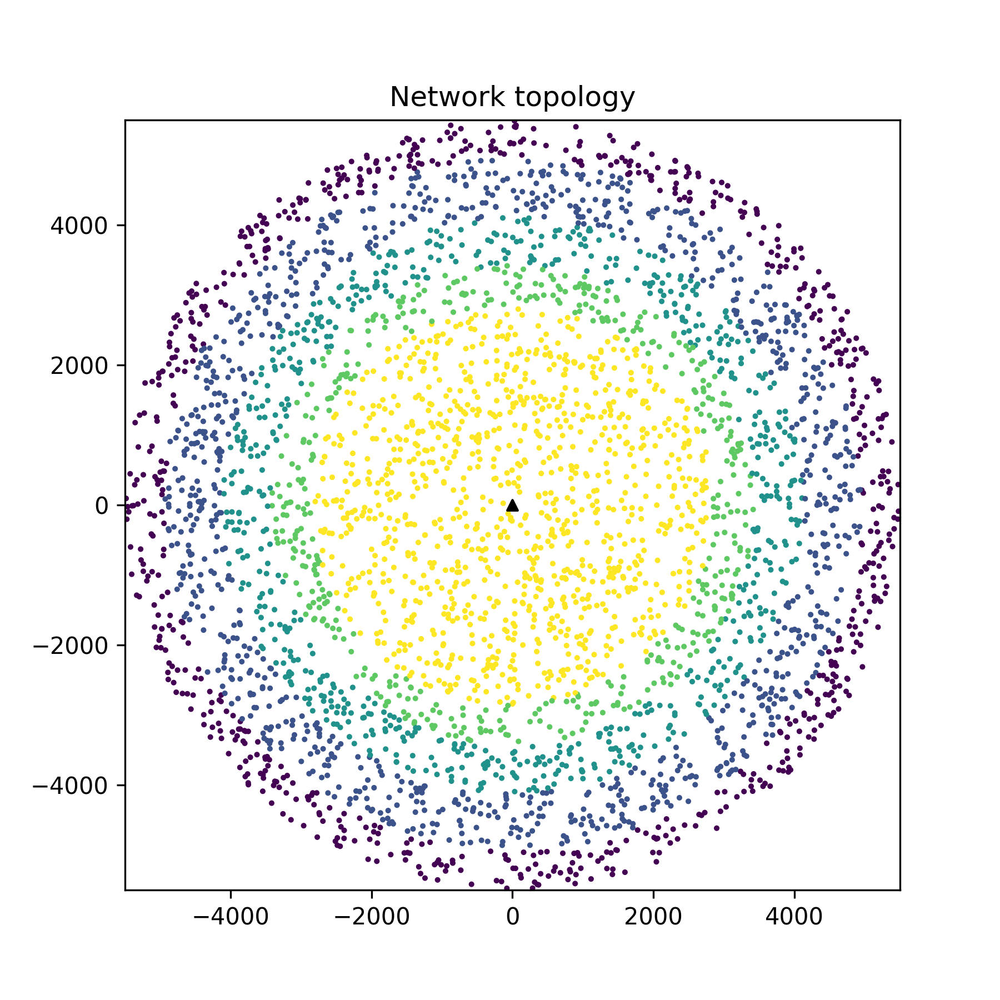
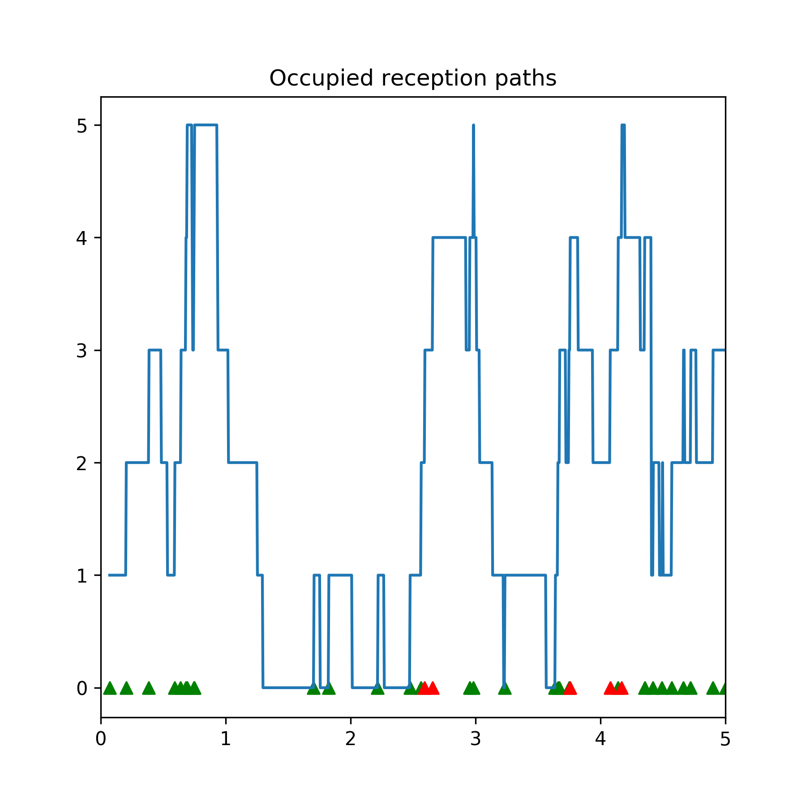
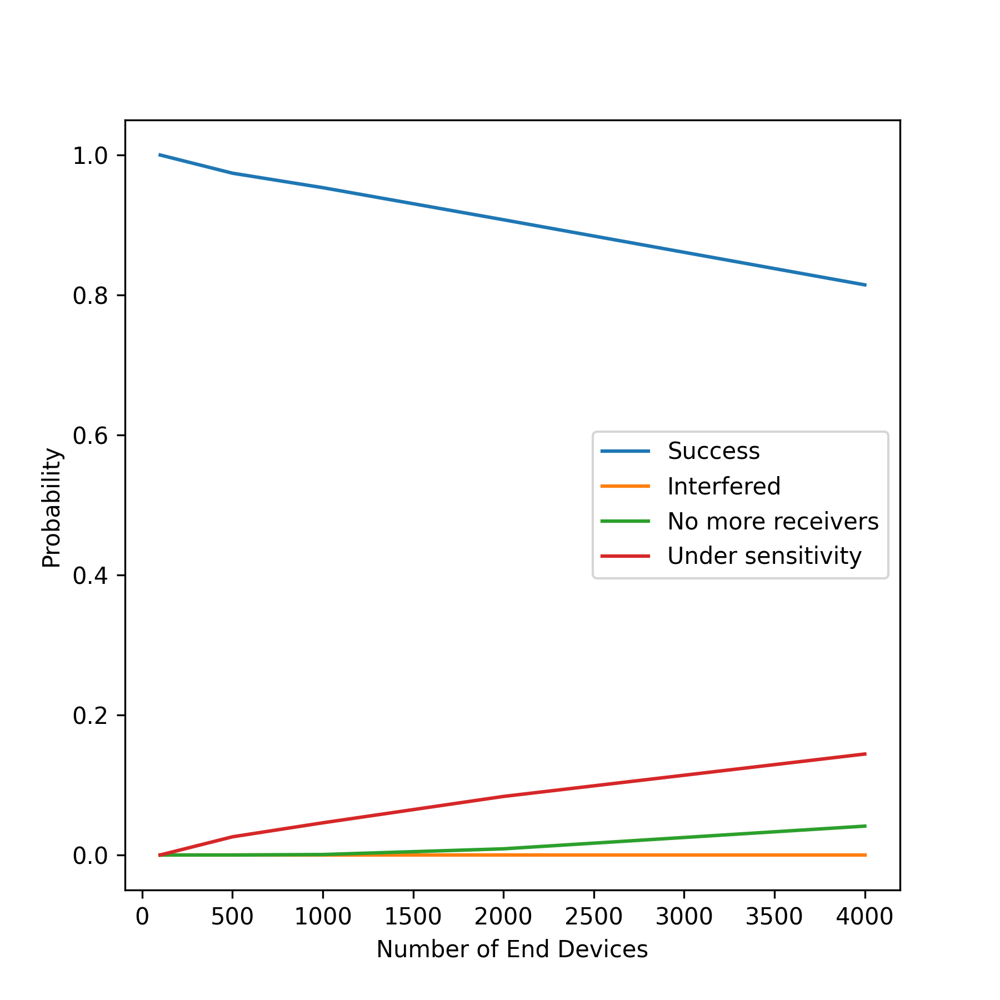

Examples walkthrough
====================

SEM offers some examples in the form of python scripts in the `examples/`
folder. This page walks through these scripts, explains what they achieve and
how they leverage the facilities provided by SEM with different objectives.

`wifi_plotting_xarray.py`
-------------------------

This example showcases how SEM's integration with the `xarray` python library
can be leveraged to quickly obtain plots. After running simulations through the
`run_missing_simulations` method, results are exported to an `xarray` data
structure through the `get_results_as_xarray` function.

This function essentially goes over the specified parameter space, and applies
a user-defined function to each one, to obtain some metrics. In the case of the
`wifi_plotting_xarray.py` example, a `get_average_throughput` function is
defined. This function takes as parameter a result, in the form of a dictionary
with the following structure:

.. code::

  result = {
    'meta': {
      'id': Simulation ID,
      'elapsed_time': Time spent running the simulation,
    },
    'params': {
      'param1': Value,
      ...
    }
    'output': {
      'stdout': String containing output of simulation,
      'stderr': String containing errors of simulation,
      'filename': Contents of filename output file,
      ...
    }
  }

and outputs a single value, which is obtained by parsing the `stdout` field of
the `output` value. The resulting structure is then saved in the `results`
variable, and can be inspected by using the `print` function. The following
lines then exemplify how the results `xarray` can be queried through the `sel`
function in a very natural way, by specifying the parameter and the desired
value as optional parameters. Furthermore, notice how the `reduce` function can
be used to process multiple repetitions of the same parameter combination and
extract the average and standard deviation metrics. In order to obtain the
second plot, notice how the `stack` functionality provided by `xarray` was
leveraged. This function essentially performs all possible combinations of the
specified parameters, and plots multiple lines (one for each combination of the
values) when `stacked_params.plot.line()` is called.

The plots produced by this script are saved in `examples/figures/`, and are
reproduced below.

    Throughput for different parameter configurations, with error bars.

    Comparison of throughput for additional parameter configurations.

`lorawan_parsing_example.py`
----------------------------

The `lorawan_parsing_example.py` script first shows how to use SEM to run
simulations and plot results of single runs, and then shows how to use the
`xarray` exporting function in conjunction with a custom-written function in
order to extract and visualize multiple metrics at once.

After running some simulations of a LoRaWAN network [#]_, the script focuses on
one single result, obtained through the `campaign.db.get_complete_results()`
function, and performs a couple visualizations of the network topology and of
how the value of a parameter changes in the simulated time. This example shows
how the output files can be easily imported and parsed to produce visualizations
of what is happening in the network.

    A representation of the network topology.

    The number of packets currently in reception with respect to time. Packet
    arrivals are shown as triangles, green for successful packets and red for
    lost packets.

Finally, the script plots some global metrics, computing the outcome
probabilities of packets through a custom `get_outcome_probabilities` function
that is passed to `get_results_as_xarray`. Additionally, a `metrics` list is
passed so that the export function can correctly label the dimension containing
results.

    Probabilities for different packet outcomes for a growing number of end
    devices.

.. [#] For additional information on the LoRaWAN module, refer to the project's
       `github page`_.

.. _`github page`: https://github.com/signetlabdei/lorawan
