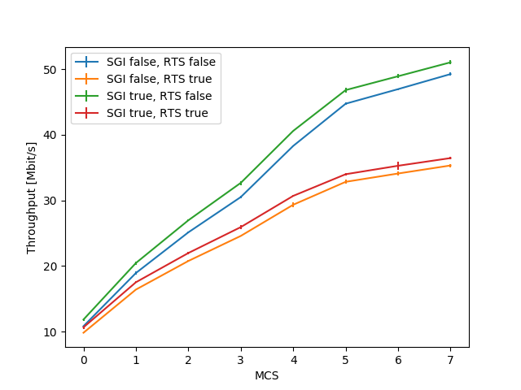

Getting started
===============

This page only provides an initial guide that illustrates the SEM workflow using
the Python API. For a more comprehensive overview of how things work under
the hood, refer to the :ref:`detailed-functionality` page. If you are interested
in using SEM from the command line, check out the :ref:`cli` page instead.

`SEM` operates on simulation campaigns, which consist in a collection of results
obtained from running a specific `ns-3` simulation script with possibly varying
command line parameters.

Simulation campaigns are saved in a single folder for portability, and are
accessible through a `CampaignManager` object. Through this class it's possible
to create new campaigns, load existing ones, run simulations and export results
to a variety of formats for analysis and plotting.

In the following sections we will use `SEM` to go from a vanilla ns-3
installation (assumed to be available at `./examples/ns-3`) to plots visualizing
the results, in as few commands as possible. A script containing many commands
of this section is available at the sem project github_, under
`examples/wifi_example.py`.

.. _github: https://github.com/signetlabdei/sem

Creating and loading a simulation campaign
------------------------------------------

Creation of a new campaign requires:

* The path of the ns-3 installation to use
* The name of the simulation script that will be run
* The location of the folder where the campaign will be saved.

We can create a campaign using the following instructions in a Python
interpreter or script::

  >>> import sem
  >>> ns_path = 'examples/ns-3'
  >>> script = 'wifi-multi-tos'
  >>> campaign_dir = '/tmp/wifi-plotting-example'
  >>> campaign = sem.CampaignManager.new(ns_path, script, campaign_dir, overwrite=True)

Internally, `SEM` also checks whether the path points to a valid ns-3
installation, and whether the script is actually available for execution or not.
If a simulation campaign already exists at the specified `campaign_dir`, and if
it points to the same `ns_path` and `script` values, that campaign is loaded
instead. Otherwise, the `campaign_dir` folder is created from scratch and a new
campaign is created.

`CampaignManager` objects can also be directly printed to inspect the status of
the campaign:

::

   >>> print(campaign) # doctest: +SKIP
   --- Campaign info ---
   script: wifi-multi-tos
   params: ['nWifi', 'distance', 'simulationTime', 'useRts', 'mcs',
            'channelWidth', 'useShortGuardInterval']
   HEAD: 9386dc7d106fd9241ff151195a0e6e5cb954d363
   ---------------------

Note that, additionally to the path and script we specified in the campaign
creation process, `SEM` also retrieved a list of the available script parameters
and the SHA of the current HEAD of the git repository at the `ns-3` path.

Running simulations
-------------------

Simulations can be run by specifying a list of parameter combinations.

::

  >>> param_combination = {
  ...    'nWifi': 1,
  ...    'distance': 1,
  ...    'simulationTime': 10,
  ...    'useRts': False,
  ...    'mcs': 7,
  ...    'channelWidth': 20,
  ...    'useShortGuardInterval': False,
  ...    'RngRun': 0
  ... }
  >>> campaign.run_simulations([param_combination])

  Running simulations: 100% 1/1 [00:10<00:00, 10.81s/simulation]

As simulations are run, the results are also saved in the campaign database, at
the previously specified `campaign_dir` path. After the simulation finishes, the
results (i.e., any generated output files and the standard output) are added to
the database and can be retrieved later on. A progress bar is displayed to
indicate progress and give an estimate of the remaining time.

Multiple simulations corresponding to the exploration of a parameter space can
be easily run by employing the `list_param_combinations` function, which can
take a dictionary specifying multiple values for a key and translate it into a
list of dictionaries specifying all combinations of parameter values. For
example, let's try the same simulation parameters as before, but perform the
simulations both for the `true` and `false` values of the `useRts` parameter::

  >>> param_combinations = {
  ...     'nWifi': 1,
  ...     'distance': 1,
  ...     'simulationTime': 10,
  ...     'useRts': [False, True],
  ...     'mcs': 7,
  ...     'channelWidth': 20,
  ...     'useShortGuardInterval': False
  ... }
  >>> campaign.run_missing_simulations(param_combinations,
  ...                                  runs=1)

  Running simulations: 100% 1/1 [00:09<00:00,  9.63s/simulation]

From the output, it can be noticed that only one simulation was run: in fact,
since we used the `run_missing_simulations` function, before running the
specified simulations, `SEM` checked whether some results were already available
in the database, found the previously executed simulation, and only performed
the simulation for which no result employing the requested parameter combination
was already available. Additionally, the `run_missing_simulations` function
requires a `runs` parameter, specifying how many runs should be performed for
each parameter combination. Note the difference with `run_simulations`:
`run_simulations` will run all the simulations in the specified list, regardless
of the number of already available reproductions we have.
`run_missing_simulations`, instead, will only run the simulations that are
needed to obtain `runs` repetitions of a set parameter combination (hence the
need for the `runs` parameter, which is not required by `run_simulations`).

Finally, let's make `SEM` run multiple simulations so that we have something to
plot. In order to do this, first we define a new `param_combinations`
dictionary, ranging the `mcs` parameter from 0 to 7 and turning on and off the
`RequestToSend` and `ShortGuardInterval` parameters::

  >>> param_combinations = {
  ...     'nWifi': 1,
  ...     'distance': 1,
  ...     'simulationTime': 10,
  ...     'useRts': [False, True],
  ...     'mcs': list(range(1, 8, 2)),
  ...     'channelWidth': 20,
  ...     'useShortGuardInterval': [False, True]
  ... }
  >>> campaign.run_missing_simulations(param_combinations,
  ...                                  runs=2)

  Running simulations: 100% 32/32 [02:57<00:00,  3.86s/simulation]

Exporting results
-----------------

Results can be exported to the `numpy` and `xarray` formats for Python
elaboration, and to a directory tree, `.mat` and `.npy` file formats for
processing outside Python.

Available results can be inspected using the `DatabaseManager` object associated
to the `CampaignManager`, and available as the `db` attribute of the campaign.
For instance, let's check out the first result::

  >>> len(campaign.db.get_results())
  32
  >>> campaign.db.get_results()[0] # doctest: +SKIP
  {
    'nWifi': 1,
    'distance': 1,
    'simulationTime': 10,
    'useRts': False,
    'mcs': 7,
    'channelWidth': 20,
    'useShortGuardInterval': False,
    'RngRun': 1,
    'id': '771e0511-43b9-4e33-aa6a-dc4266be24f1',
    'elapsed_time': 4.270819187164307,
    'stdout': 'Aggregated throughput: 49.2696 Mbit/s\n'
  }

Results are returned as dictionaries, with a key-value pair for each available
script parameter, and the following additional fields:

  * `RngRun`: the `--RngRun` value that was used for this simulation (used to
    set the "`seed`" of the simulator's random number generator);
  * `id`: an unique identifier for the simulation;
  * `elapsed_time`: the required time, in seconds, to run the simulation;
  * `stdout`: the output of the simulation script.

At its current state, the `SEM` library supports automatic parsing of the
`stdout` result field: in the following lines we will define a
`get_average_throughput` function, which transforms strings formatted like the
`stdout` field of the result above into float numbers containing the average
throughput measured by the simulation. `SEM` will then use the function to
automatically clean up the results before putting them in an `xarray`
structure::

  >>> def get_average_throughput(result):
  ...     # This function takes a result and parses its standard output to extract
  ...     # relevant information
  ...     return [float(result['output']['stdout'].split(" ")[-2])]

  >>> results = campaign.get_results_as_xarray(param_combinations,
  ...                                          get_average_throughput,
  ...                                          ['AvgThroughput'], runs=2)

      <xarray.DataArray (useRts: 2, mcs: 8, useShortGuardInterval: 2, runs: 2)>
      array([[[[10.8351 , 10.8057 , 10.8163 ],
              [11.849  , 11.8549 , 11.7901 ]],

              [...]

              [[35.2868 , 35.3763 , 35.3044 ],
              [36.4903 , 36.4137 , 36.4432 ]]]])
      Coordinates:
        * useRts                 (useRts) <U5 'false' 'true'
        * mcs                    (mcs) int64 0 1 2 3 4 5 6 7
        * useShortGuardInterval  (useShortGuardInterval) <U5 'false' 'true'
        * runs                   (runs) int64 0 1 2

Finally, we can easily plot the obtained results by appropriately slicing the
`DataArray`::

  >>> import matplotlib
  >>> matplotlib.use('Agg')
  >>> import matplotlib.pyplot as plt
  >>> import numpy as np
  >>> # Iterate over all possible parameter values
  >>> for useShortGuardInterval in [False, True]: # doctest: +SKIP
  ...   for useRts in [False, True]:
  ...       avg = results.sel(useShortGuardInterval=useShortGuardInterval,
  ...                         useRts=useRts).reduce(np.mean, 'runs')
  ...       std = results.sel(useShortGuardInterval=useShortGuardInterval,
  ...                         useRts=useRts).reduce(np.std, 'runs')
  ...       eb = plt.errorbar(x=param_combinations['mcs'], y=avg, yerr=6*std,
  ...                    label='SGI %s, RTS %s' % (useShortGuardInterval, useRts))
  ...       xlb = plt.xlabel('MCS')
  ...       ylb = plt.ylabel('Throughput [Mbit/s]')
  >>> legend = plt.legend(loc='best') # doctest: +SKIP
  >>> plt.savefig('docs/throughput.png') # doctest: +SKIP

    The plot obtained from the simulations.
